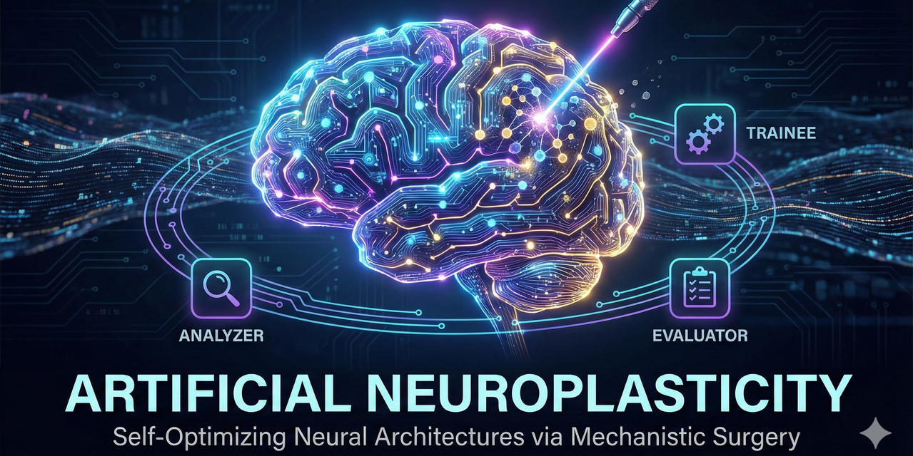

# Artificial_Neuroplasticity
Phase zero of Artificial Neuroplasticity: Giving models self-editing capacity, through a trained triumvirate of three models; Analyzer  / Trainee /  Evaluator. The Analyzer uses TransformerLens to watch the Trainee. The Evaluator is the Review Board,, confirming the Trainee has become smarter than itself. This IS NOT implemented in this phase zero.
